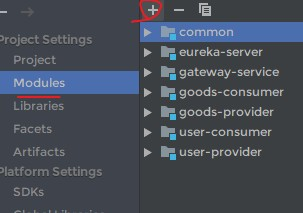

# cloudmall

### SpringCloud配套教材的商城项目学习案例

### 1.运行环境
```
idea或者eclipse(有spring环境的)
maven
jdk1.8以上
redis
mysql
```

### 2.运行步骤
```
git clone https://github.com/JachinLin123/cloudmall.git
```
- 先将docs里面的SQL文件运行到mysql中(记得先创建一个名为cloudmall的数据库)
- 用idea打开这个文件(如果不报错,也就是项目都可以读取到,如下图,则跳过下一步,否则进行下一步)

- (如果读取不到项目的话,可以先用idea创建一个空项目,名称为cloudmall,然后依次添加这五个modules,下面有介绍)


- 修改user-provider和goods-provider里面的配置文件(主要是数据库配置)
- 依次启动eureka-server ----> user-provider ----> user-consumer ----> goods-provider ----> goods-consumer ----> gateway-service

### 3.下面就说说项目基本架构

- 系统架构图


- 模块划分
```shell
common #公共项目.存放的是实体类,通过依赖注入到其他项目
eureka-server #作为服务中心,微服务架构心脏
gateway-service #网关服务
goods-consumer #商品模块服务消费者
goods-provider #商品模块服务提供者
user-consumer #用户模块服务消费者
user-provider #用户模块服务提供者

```

- user-service和goods-service调用过程


##欢迎大家star和fork